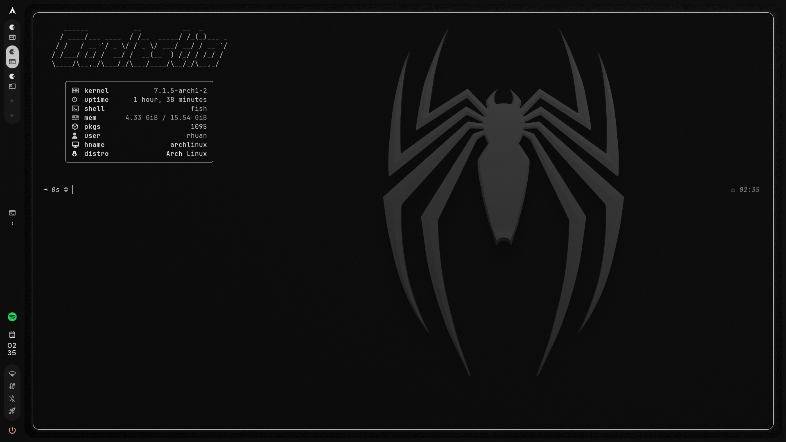

# 🐧 Arch Linux + Hyprland Dotfiles

<p align="center">
  
</p>

<p align="center">
  Minha configuração pessoal do <b>Arch Linux</b> utilizando <b>Hyprland</b>, <b>Caelestia</b> e outras ferramentas.
</p>

---

## ✨ Sobre

Este repositório contém minhas configurações pessoais para meu ambiente Linux.

O objetivo é manter minhas configurações organizadas, facilitar a reinstalação do sistema e permitir que outras pessoas possam consultar ou utilizar partes delas.

> ⚠️ Estas configurações foram feitas para o meu computador.
> Algumas partes podem precisar de ajustes dependendo do hardware e da distribuição utilizada.

---

## 🖥️ Ambiente

| Componente | Utilizado |
|---|---|
| 🐧 Sistema | Arch Linux |
| 🪟 Window Manager | Hyprland |
| 🎨 Desktop/Shell | Caelestia |
| 🐚 Shell | Fish |
| 📝 Editor | Neovim |
| 📊 Barra | Waybar |
| 📁 Gerenciador de arquivos | Thunar |
| 🌐 Browser | Firefox |
| 💻 Editor de código | Code - OSS |
| 🎮 Games | Steam |

---

## 📂 Estrutura

```text
arch-hyprland-dotfiles/
│
├── caelestia/          # Configurações do Caelestia
├── fish/               # Configurações do Fish
├── hypr/               # Configurações do Hyprland
├── nvim/               # Configurações do Neovim
│
├── screenshots/        # Capturas do desktop
│
├── .gitignore
└── README.md
```

---

## ⌨️ Atalhos

Alguns dos meus atalhos personalizados:

| Atalho | Função |
|---|---|
| `Super + Enter` | Terminal |
| `Super + B` | Firefox |
| `Super + C` | Code - OSS |
| `Super + E` | Thunar |
| `Super + G` | Steam |
| `Super + X` | Fechar janela |
| `Super + L` | Bloquear tela |
| `Alt + Tab` | Alternar entre janelas |
| `Super + ←` | Focar janela à esquerda |
| `Super + →` | Focar janela à direita |
| `Super + ↑` | Focar janela acima |
| `Super + ↓` | Focar janela abaixo |
| `Super + Shift + ←` | Mover janela para esquerda |
| `Super + Shift + →` | Mover janela para direita |
| `Super + Shift + ↑` | Mover janela para cima |
| `Super + Shift + ↓` | Mover janela para baixo |

Os atalhos personalizados ficam principalmente em:

```text
~/.config/caelestia/hypr-vars.lua
```

e:

```text
~/.config/caelestia/hypr-user.lua
```

---

## 🎨 Caelestia

O Caelestia é responsável por grande parte da aparência e integração do meu desktop.

Utilizo recursos como:

- 🖼️ Wallpapers
- 🎨 Temas baseados no wallpaper
- 🔔 Notificações
- 🎵 Controles de mídia
- 📋 Clipboard
- 🔒 Lock screen
- 📸 Screenshots
- 🔊 Controle de volume
- 💡 Controle de brilho
- 🖥️ Workspaces
- ⌨️ Atalhos personalizados

---

## 🖼️ Wallpapers

Meus wallpapers ficam em:

```text
~/Imagens/Wallpapers/
```

Para alterar o wallpaper utilizando o Caelestia:

```bash
caelestia wallpaper -f "$HOME/Imagens/Wallpapers/wallpaper.jpg"
```

Para escolher um wallpaper aleatório:

```bash
caelestia wallpaper -r "$HOME/Imagens/Wallpapers"
```

O Caelestia também pode alterar automaticamente o esquema de cores de acordo com o wallpaper.

---

## 🚀 Instalação

> ⚠️ **Importante:** este repositório contém configurações pessoais.  
> Algumas configurações podem precisar de ajustes dependendo do seu hardware.

### 1. Clone o repositório

```bash
git clone https://github.com/rhuffs/arch-hyprland-dotfiles.git
```

Entre na pasta:

```bash
cd arch-hyprland-dotfiles
```

### 2. Faça backup das configurações atuais

Antes de copiar qualquer configuração:

```bash
mkdir -p ~/.config/backup-dotfiles
```

Depois:

```bash
cp -r ~/.config/hypr ~/.config/backup-dotfiles/ 2>/dev/null || true
cp -r ~/.config/caelestia ~/.config/backup-dotfiles/ 2>/dev/null || true
cp -r ~/.config/fish ~/.config/backup-dotfiles/ 2>/dev/null || true
cp -r ~/.config/nvim ~/.config/backup-dotfiles/ 2>/dev/null || true
```

### 3. Copie as configurações

```bash
cp -r hypr ~/.config/
cp -r caelestia ~/.config/
cp -r fish ~/.config/
cp -r nvim ~/.config/
```

### 4. Recarregue o Hyprland

```bash
hyprctl reload
```

Se necessário, reinicie a sessão.

---

## 🛠️ Programas utilizados

```text
Arch Linux
Hyprland
Caelestia
Fish
Neovim
Waybar
Thunar
Firefox
Code - OSS
Steam
Git
```

---

## 🐧 Filosofia

A ideia deste setup é manter um ambiente:

```text
⚡ Rápido
🎨 Bonito
⌨️ Controlado pelo teclado
🧩 Modular
🐧 Linux
```

Grande parte das tarefas do dia a dia pode ser realizada através de atalhos de teclado e ferramentas de terminal.

---

## 📸 Screenshots

### 🖥️ Desktop

<p align="center">
  
  

</p>

---

## 🔧 Personalização

As configurações podem ser modificadas diretamente dentro de:

```text
~/.config/hypr/
~/.config/caelestia/
~/.config/fish/
~/.config/nvim/
```

### Caelestia

Para editar as configurações pessoais:

```bash
nvim ~/.config/caelestia/hypr-user.lua
```

### Atalhos

Para editar os atalhos:

```bash
nvim ~/.config/caelestia/hypr-vars.lua
```

### Hyprland

As configurações do Hyprland ficam em:

```bash
~/.config/hypr/
```

---

## 🎯 Recursos

- [x] Hyprland
- [x] Caelestia
- [x] Fish Shell
- [x] Neovim
- [x] Waybar
- [x] Wallpapers
- [x] Temas dinâmicos
- [x] Atalhos personalizados
- [x] Workspaces
- [x] Suporte a múltiplos monitores
- [x] Integração com Steam
- [x] Integração com Firefox
- [x] Integração com Code - OSS

---

## 📚 Objetivo deste repositório

Este projeto também funciona como uma forma de documentar minha evolução utilizando Linux.

Estou constantemente modificando e melhorando o setup conforme aprendo novas ferramentas e tecnologias.

---

## 👤 Autor

### Rhuan Leandro

🎓 Estudante de Ciência da Computação

🐧 Arch Linux

💻 Desenvolvimento de Software

🌐 GitHub: [@rhuffs](https://github.com/rhuffs)

---

<p align="center">
  Feito com 🐧 e bastante terminal.
</p>
